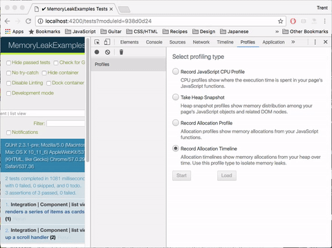
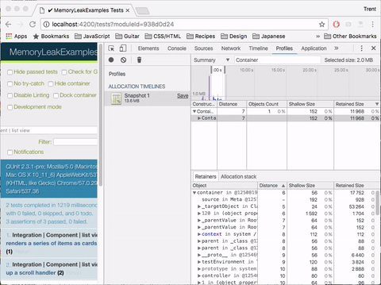

# Exercise #2 - Callback Leaks

This exercise will build on what we covered in [Exercise #1](./exercise-1.md)
and will look at "callback" leaks. These are memory leaks that occur due to
state being caught in a callback function that is never released from memory.

## Identifying The Leak

Similar to before, we need to start by identifying the leak. The test we're
concerned with is "_Integration | Component | list view_".

Practice using "Record Allocation Timeline" and "Take Heap Snapshot" to figure
out what might be the leak before taking a look below.

---



In the above gif, you can see that you can actually use the "Record Allocation
Timeline" to find leaked objects. Since we're concerned with objects leaking
during the tests, we simply narrow the window to that time range and then use
the class filter. This is similar to what we previously did with "Take Heap
Snapshot" in Exercise #1.

We can then look through the retainers like we did previously to try and figure
out where the leak is happening in the actual code.



There are two things to note in the above:

First, we're interested in `_this` was retained by `context in ()`: When you encounter a pattern
like this for the first time, it can look very odd. The `_this` is a variable
introduced during transpilation by Babel. The `context in ()` is telling us that
`_this` is retained in context by an anonymous function.

In other words, our original code:

```js
export default Ember.Component.extend({
  didInsertElement() {
    if (this.get('onScroll')) {
      window.addEventListener('scroll', (...args) => this.get('onScroll')(...args));
    }
  }
});
```

Is transpiled to something like:

```js
export default Ember.Component.extend({
  didInsertElement() {
    if (this.get('onScroll')) {
      var _this = this;
      window.addEventListener('scroll', function(...args) { return _this.get('onScroll')(...args) });
    }
  }
});
```

Which should make it obvious how `_this` is retained by the context of an
anonymous function. This should not be happening, we don't want this to stay
around after the life of the component.

Second, you can hover to link to code: Once we identified an area of interest,
we were able to hover over the `context in ()` phrase and link to the exact spot
in the code where it was occuring. This is very useful for debugging retainers
that are in context/scope.

## Fixing the Leak

This is a callback leak. Since callback functions for things like event
listeners and interval timers are retained by reference elsewhere, you
must be careful to unregister them when no longer needed or ensure that
the context they're registered with is destroyed. In this case, Since
`window` is never destroyed/removed, this callback will continue to
exist forever and since its callback closes over a reference to this
component, we have a bad memory leak. The solution is to remove this
event listener in `willDestroy`.

So, we can update our original component implementation to look something like
this:

```js
export default Ember.Component.extend({
  didInsertElement() {
    if (this.get('onScroll')) {
      this._onScrollHandler = (...args) => this.get('onScroll')(...args);
      window.addEventListener('scroll', this._onScrollHandler);
    }
  },

  willDestroy() {
    window.removeEventListener('scroll', this._onScrollHandler);
  }
});
```

And that should fix our memory leak!

At this point you should run the tests again and check to make sure the leak
was actually fixed. You should _always verify your work_, particularly when it
comes to nuanced tasks like fixing memory leaks or improving performance.

If you did everything correctly, you should discover that the memory leak isn't
fixed yet! But, if you look closely, you'll notice that it isn't the same one as
before. To dig into that, we'll move to the next exercise.

## Key Takeaways

* Be careful when registering callbacks; ensure they get cleaned up
* Sometimes memory leaks just by being in context/scope of a retained function
* There may be more than one thing leaking a given object

[Prev: Exercise #1](./exercise-1.md) | [Next: Exercise #3](./exercise-3.md)
